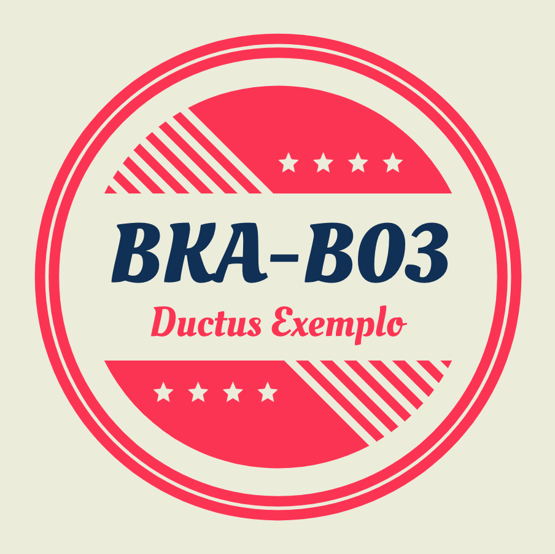
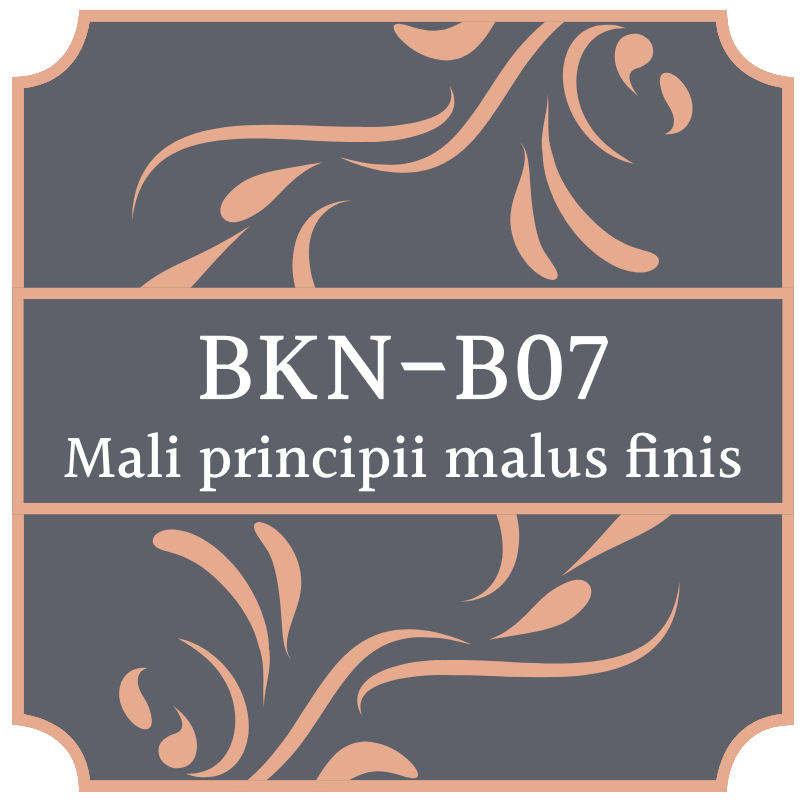
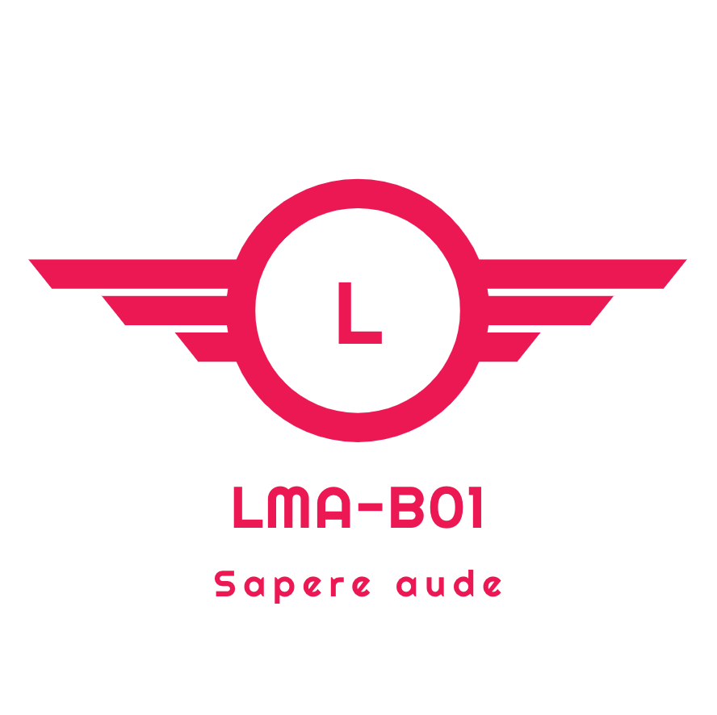
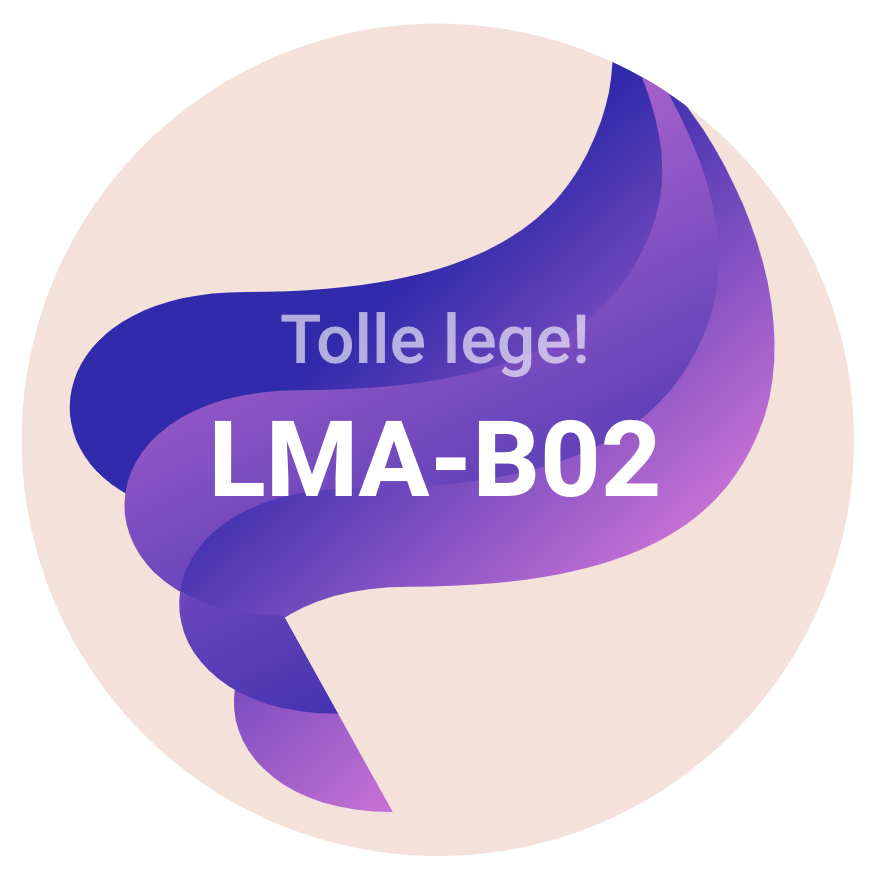

```{r setup, include=FALSE}
knitr::opts_chunk$set(echo = TRUE)
```

Dit is het platform voor B-cluster Onderzoek van de opleiding HAN Bedrijfskunde. Hier plaatsen we materiaal dat specifiek gericht is uit onderstaande groepen die in dit semester deze module volgen.

Voor alle algemene, propedeuse-brede informatie verwijzen we naar het materiaal op <a href="https://onderwijsonline.han.nl/elearning/content/pNWMKBDj" target="_blank">Onderwijs Online</a>. Mocht je vragen hebben waarvoor je de antwoorden niet online hebt gevonden, dan kun je mailen naar: <a href="mailto:witek.tenhove@han.nl?Subject=B-cluster%20onderzoek%20" target="_top">Witek ten Hove</a>, <a href="mailto:david.hartsuiker@han.nl?Subject=B-cluster%20onderzoek%20" target="_top">David Hartsuiker</a> of <a href="mailto:frans. beijderwellen@han.nl?Subject=B-cluster%20onderzoek%20" target="_top">Frans Beijderwellen</a>

-----

## Teams { .tabset}

### BKA-B03



Ieder team houdt de voortgang bij in een online notebook of logboek. Volg onderstaande links voor de afzonderlijke documenten:

- <a href="" target="_blank">Team 1</a>
- <a href="" target="_blank">Team 2</a>
- <a href="" target="_blank">Team 3</a>
- <a href="" target="_blank">Team 4</a>
- <a href="http://mvoost.simplesite.com/" target="_blank">Team 5</a>
- <a href="" target="_blank">Team 6</a>
- <a href="" target="_blank">Team 7</a>
- <a href="" target="_blank">Team 8</a>
- <a href="" target="_blank">Team 9</a>
- <a href="" target="_blank">Team 10</a>

### BKN-B07



Ieder team houdt de voortgang bij in een online notebook of logboek. Volg onderstaande links voor de afzonderlijke documenten:

- <a href="" target="_blank">Team 1</a>
- <a href="" target="_blank">Team 2</a>
- <a href="" target="_blank">Team 3</a>
- <a href="" target="_blank">Team 4</a>
- <a href="" target="_blank">Team 5</a>
- <a href="" target="_blank">Team 6</a>
- <a href="" target="_blank">Team 7</a>
- <a href="" target="_blank">Team 8</a>
- <a href="" target="_blank">Team 9</a>
- <a href="" target="_blank">Team 10</a>

### LMA-B01



Ieder team houdt de voortgang bij in een online notebook of logboek. Volg onderstaande links voor de afzonderlijke documenten:

- <a href="https://docs.google.com/document/d/10PUY4awe97yO6s4NEMfqIcjD_h5q_QxMZRAQLf7M0Z0/edit" target="_blank">Team 1</a>
- <a href="https://docs.google.com/document/d/1ENVc82aNopEMhDnFMjGS5RAOoOQND1iXdpDx3Q2KXJI/edit" target="_blank">Team 2</a>
- <a href="https://docs.google.com/document/d/1w8DvigfVpDxMLIPuNss9QnjbCJ_rjqlvkvlrhznGKUU/edit" target="_blank">Team 3</a>
- <a href="https://docs.google.com/document/d/1GENH__7wyxnnder-75wbmdzOkwGr4zW6KbmG26Zpp6k/edit" target="_blank">Team 4</a>
- <a href="https://docs.google.com/document/d/1UgfGYsN9i5SktFsjl0VMy2yARfHTB9LJplZQiy58hto/edit" target="_blank">Team 5</a>
- <a href="" target="_blank">Team 6</a>
- <a href="" target="_blank">Team 7</a>
- <a href="" target="_blank">Team 8</a>
- <a href="" target="_blank">Team 9</a>
- <a href="" target="_blank">Team 10</a>

### LMA-B02



Ieder team houdt de voortgang bij in een online notebook of logboek. Volg onderstaande links voor de afzonderlijke documenten:

- <a href="https://docs.google.com/document/d/1CWhdFefPOMxk-HyhbkTLbwJa3EsLM8l9P-KThzSX0Ig/edit#heading=h.37k9i2larym8" target="_blank">Team 1</a>
- <a href="https://docs.google.com/document/d/1GKC4ZCZ3qZE5YkBy1zZLrT63cxFIt-cj-3gZLUfH5xQ/edit" target="_blank">Team 2</a>
- <a href="https://docs.google.com/document/d/1GYYmSd-txfRiF06xFITTGWlrQ13WWoF3OAzDzpzjCu0/edit#heading=h.g657mr24mt0w" target="_blank">Team 3</a>
- <a href="https://docs.google.com/document/d/1reNzdhxc1ekXkWpR7wUAO6cSBQc-6v4fNeSrnEPqxUU/edit#heading=h.4no0ops4xi49" target="_blank">Team 4</a>
- <a href="https://docs.google.com/document/d/1Pt5wessAA-BzPhsR_YiYoeaive-18M_RE0gJcMDlMU4/edit#heading=h.c3o8ol3zior" target="_blank">Team 5</a>
- <a href="" target="_blank">Team 6</a>
- <a href="" target="_blank">Team 7</a>
- <a href="" target="_blank">Team 8</a>
- <a href="" target="_blank">Team 9</a>
- <a href="" target="_blank">Team 10</a>